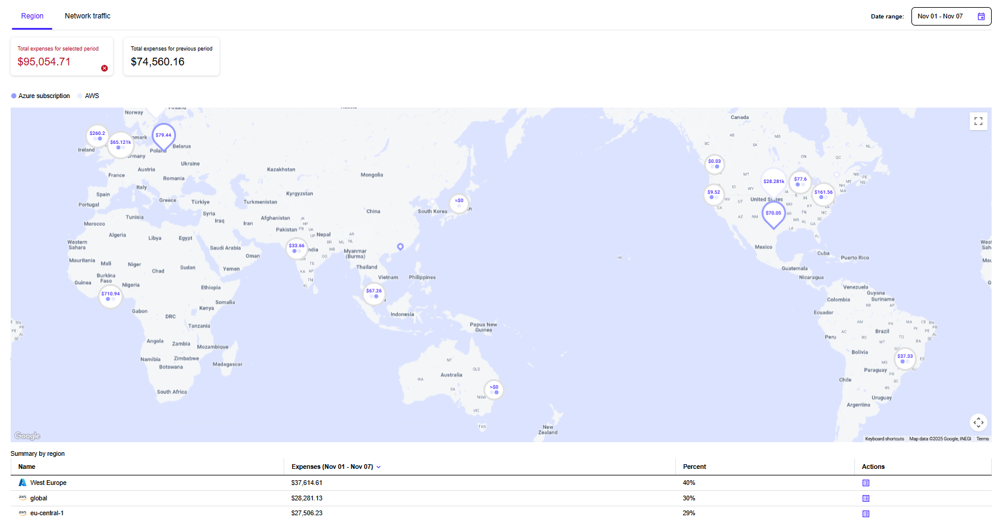

# Cost Map

Cost map is an easy-to-use visualization tool that provides an overview of your organization’s cloud expenses. It enables you to view a breakdown of expenses by location/region and service to identify areas of high spending and understand usage patterns.&#x20;

Cost map supports all Microsoft Azure, AWS cloud, and GCP regions. You can use the cost map to visualize regional cloud spend and network traffic at a glance.&#x20;

* The **Region** cost map allows you to view your total expenses for both the current and previous periods. You can also visualize your spending geographically across cloud providers and regions.&#x20;
* The **Network traffic** cost map allows you to visualize data transfer and connectivity costs. You can view accumulated expenses for paid network traffic between regions or services.&#x20;

Both cost maps contain a date range filter, allowing you to select a custom date range or choose from predefined time range options to view the expenses you are interested in.

### Region cost map

The **Region** cost map contains various visual elements to help you differentiate cloud providers and expenses.&#x20;

<figure><figcaption>
The Region cost map in FinOps for Cloud.
</figcaption></figure>

* The map uses color coding to differentiate between cloud providers. Refer to the legend above the map to interpret colors.&#x20;
* Each circle on the map represents the total cost for a specific region. If no spending is detected during the selected period, the circle shows a value of zero.
* The size of the circle indicates the level of expense; for example, larger circles indicate higher costs.&#x20;
* Round circles represent the combined costs across multiple cloud providers. For example, the circle over Ireland in the above image represents the total spending for both Azure and AWS (for example, `$260.2`).&#x20;
* Pointed circles represent only one provider (for example, the pointed circle over Poland in the above image shows Azure-only spend of `$79.44`).
* Hovering over a circle displays detailed information, including the geographical location and expenses. You can also drill down to the list of resources by selecting **Show resources**. &#x20;

The **Summary by region** table on the page lists expenses for each region along with the percentage of total expenses. You can sort the data by selecting the corresponding column header, and view the resources associated with a specific region by selecting the show resources icon in the **Actions** column.

### Network traffic cost map

The **Network traffic** cost map is a visual representation of the expenses associated with data transfer between regions. You can use this map to identify geographic locations where transfer costs are high and take steps to minimize those costs.&#x20;

<figure><figcaption>
The Network traffic cost map in FinOps for Cloud.
</figcaption></figure>

The cost map contains tabs, each representing a different cloud provider. You can switch between these tabs to view the corresponding network traffic details.&#x20;

The network traffic is displayed on the map and in the **Network traffic expenses** table. When you select a link on the map, the table is filtered to display only the relevant data. Similarly, if you select the text in the **From / To** column, the map updates to show the network traffic expenses originating from that specific source only.
