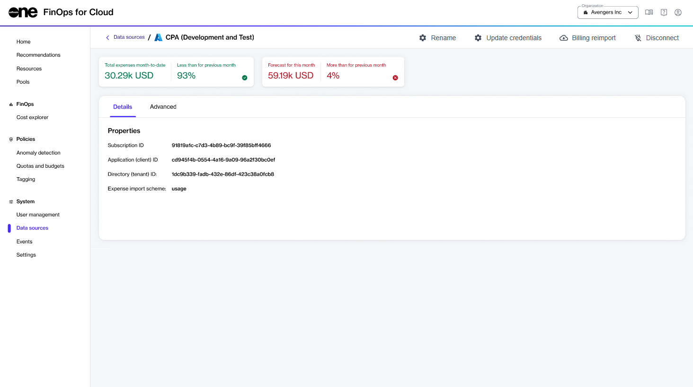

# Access Your Organization

To use FinOps for Cloud, you need an account. This account is different from your Marketplace Platform account.&#x20;

When you order a [FinOps for Cloud subscription from the SoftwareOne Marketplace](https://docs.platform.softwareone.com/extensions/finops-for-cloud/order-finops-for-cloud-from-marketplace), we will process your order and create an organization for you. This organization represents your account.

FinOps for Cloud provides different experiences for first-time access, depending on whether you are an organization administrator or user.

### FinOps for Cloud Administrators

Once we process your order, the organization administrator will receive a password recovery email containing a verification code. This email will be sent to the address specified during the ordering process.

To set up a new password and sign in, the organization administrator must follow these steps:

1. Open the password recovery email from SoftwareOne FinOps for Cloud.
2. Select **Recover password**.&#x20;

<figure><figcaption>
Password recovery email
</figcaption></figure>

3. Enter the verification code from the email and select **Confirm**.

<figure><figcaption>
Verification code
</figcaption></figure>

4. Enter your new password and confirm it matches the one you just entered. Then, select **Reset password**.
5. Select **Proceed to FinOps for Cloud** to sign in to your organization.

After signing in, you must connect your data source to FinOps. For more information, see [Add Data Sources](data-sources.md).

### FinOps for Cloud Users

If you've been added to an organization, you'll receive an invitation email from SoftwareOne FinOps for Cloud.

To join your organization:

1. Select the invite link in your email. The registration page opens.

<figure><figcaption>
Registration page
</figcaption></figure>

2. Enter your full name and password.&#x20;
3. Confirm that your new password matches the one you entered in the **Password** field, then select **Register**. You'll receive a verification code by email.
4. Enter the verification code to verify your email and select **Confirm**. You'll be directed to FinOps for Cloud.&#x20;
5. Select **Accept** to join your organization and start using FinOps for Cloud.

<figure><figcaption>
Pending invitations
</figcaption></figure>
