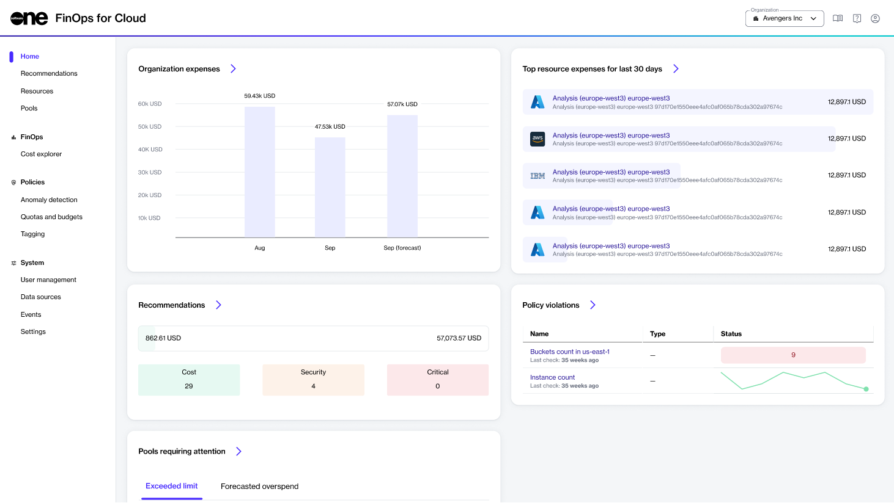

# Navigate the User Interface

After signing in to FinOps for Cloud, the first thing you’ll see is the **Home** page.

<figure><figcaption>
The Home page in FinOps for Cloud.
</figcaption></figure>

## Home page

The **Home** page is a dashboard that displays your organization’s current spending and projected expenses for the upcoming month.&#x20;

The following sections are available on the dashboard. Note that selecting the forward arrow<path d=&#x22;m321-80-71-71 329-329-329-329 71-71 400 400L321-80Z&#x22;/></svg>" data-size="line">opens up the details page for that section:

* **Organization expenses** - Displays the total expenses of the previous month, the expenses of the current month, and this month's forecast. The red line on the chart shows the expense limit.
* **Top resource expenses for the last 30 days** - Displays the resources with the highest expenses. Select the resource to open its details page.
* **Recommendations** - Displays the possible monthly savings. The expenses are separated into categories, such as **Cost**, **Security**, and **Critical**. Select the category to navigate to the Recommendations page.
* **Policy violations** - Displays all policy violations along with the policy name and type. Select the policy name to open its details page. Pay special attention to the **Status** field. If it's red, it means the policy has been violated.
* **Pools requiring attention** - Displays the **Exceeded limit** or **Forecast overspend** pools. Use the buttons in the **Actions** column to see the resources list and cost explorer.

## Sidebar

The sidebar on the left is the main navigation menu containing these options:

* [Recommendations](../../insights/recommendations/) - Displays all recommendations so you can get the most out of your connected data sources.&#x20;
* [Resources ](../../insights/resources/)- Allows you to view and allocate your expenses for the cloud resources, monitor their performance, and set constraints. See Resources to learn about organizing and categorizing resources based on your specific requirements.
* [Pools ](../../insights/pools/)- Displays pools with limits or projected expenses. You can categorize resources into a hierarchy of pools manually or using assignment rules.&#x20;
* [Cost explorer](cost-explorer.md) - Allows you to visualize your expenses.
* [Anomaly detection](../../policies/anomaly-detection/) - Allows you to identify and respond to unusual patterns or deviations from normal behavior, control costs, and manage resources efficiently.&#x20;
* [Quotas and budgets](../../policies/quotas-and-budgets/) - Allows you to create quotas and budgets.
* [Tagging policies](../../policies/tagging/) - Allows you to add new tagging policies and manage the existing ones.
* [User management](../../system/user-management/) - Allows you to invite new members to your organization and manage existing members.
* [Data sources](../../system/data-sources/) - Enables you to add your billing data sources to FinOps for Cloud.
* [Events ](../../system/events.md)- Lets you see all events that have occurred within your organization. The events include informational messages, warnings, and error messages.
* [Settings ](../../system/settings/)- Allows you to view organization details, view pending invitations, and manage email notifications.&#x20;

## Organization selector 

The **Organization** selector is available in the header.&#x20;

It displays your current organization and enables you to switch between organizations if you belong to several organizations in FinOps.

You can also select **Organization overview** for an overview of all organizations and key information for each organization. Organizations that require attention and optimization are marked in red.

## Documentation and profile buttons

The header also includes these additional options:

 - Select to access the product documentation.

 - Select to sign out of your account.
