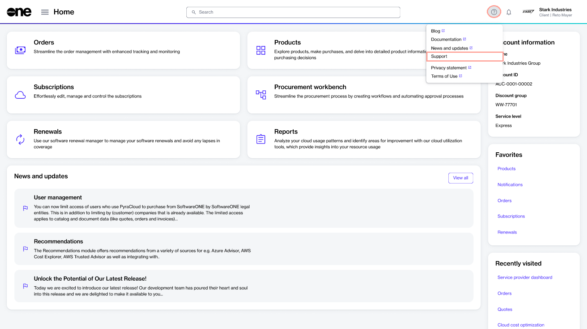

# Contact Support

If you need any assistance with your FinOps for Cloud subscription, you can contact Marketplace Platform Support.&#x20;

There are two ways to get support. You can reach out to us through email or create a ticket from the Marketplace Platform.&#x20;

Note that you might need to provide your organization ID when you are communicating with Marketplace Platform Support. You can find your organization ID on the [Settings ](../system/settings.md)page.

## Contacting support

To ensure we can assist you effectively, please write to us in English.&#x20;

To contact us by email, use this email address: [marketplace-support@softwareone.com](mailto:marketplace-support@softwareone.com).

To create a support ticket:

1. [Sign in to your Marketplace Platform account](https://portal.platform.softwareone.com).
2. Select the **Help** icon  in the header and choose **Support**.

<figure><figcaption>
Support option in the Help menu within SoftwareOne Marketplace
</figcaption></figure>

3. On the **Help and Support** page, select **Submit a Ticket**.
4. Fill out the form according to your issue. Optionally, choose **Select files** to upload documentation that might help us understand and resolve your problem quickly.
5. Select **Send**.

A confirmation message is displayed stating that your ticket has been created. If the **Send** button is unavailable, make sure you've entered the required information.
