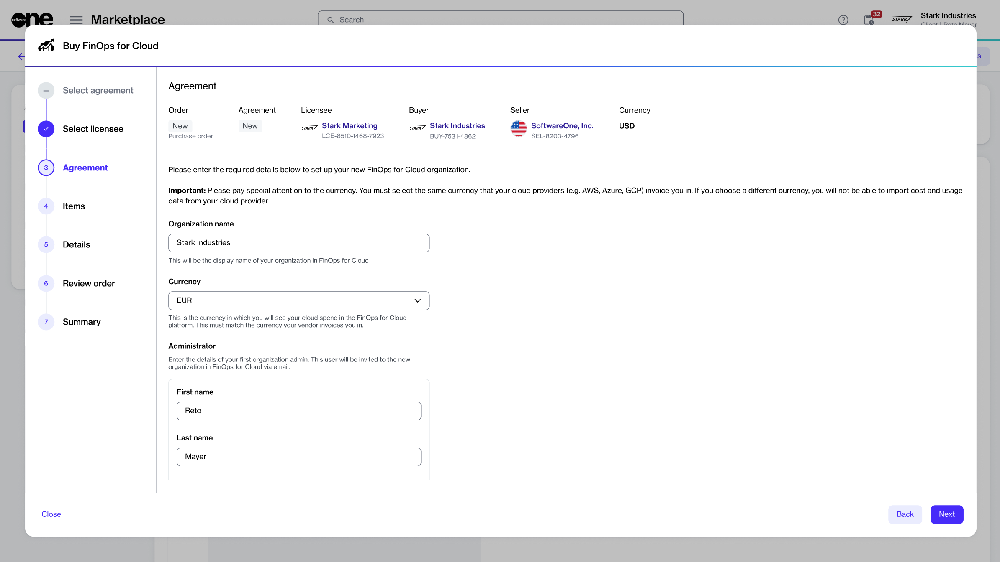

# Can I rename my organization?

Your organization name in FinOps for Cloud is based on the name entered when the subscription was ordered through the SoftwareOne Marketplace.

<figure><figcaption>
Agreement step in the wizard
</figcaption></figure>

If you want to rename your organization, you can do this from the **Settings** page in FinOps. Note that only **Organization managers** can update the name.
