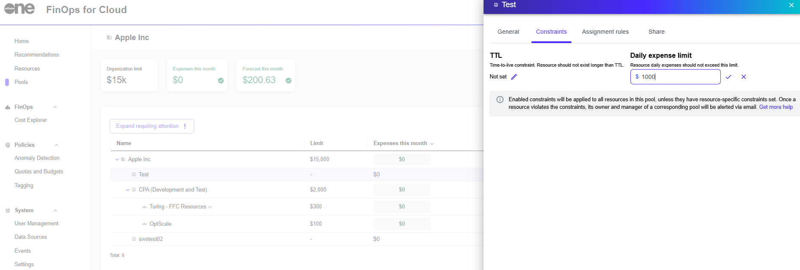

# Create Pool Constraint Policies

If you want to implement policies for an entire pool, instead of a single resource, you can do so from the **Constraints** option within the pool's details page.

Only individuals with a **Manager** role can enforce shared constraints across the pool. While shared constraints apply pool-wide, custom resource-specific constraints can still be configured and will override the general policy.

## Creating a pool constraint policy

To configure pool constraint policies:

1. Navigate to the **Pools** page.&#x20;
2. Select the desired pool group or subpool.
3. Go to the **Constrains** tab and select the edit icon.
4. Enter values in the **TTL** (Time-to-live) or **Daily expense limit** fields.&#x20;
5. Select  to save your changes. The constraint will apply to the resources within the selected pool or subpool.&#x20;

<figure><figcaption>
Pool constraint policies
</figcaption></figure>


A constraint will not be visible if the related resource has already been deleted from FinOps or if a resource has been tracked only by imported billing data.

