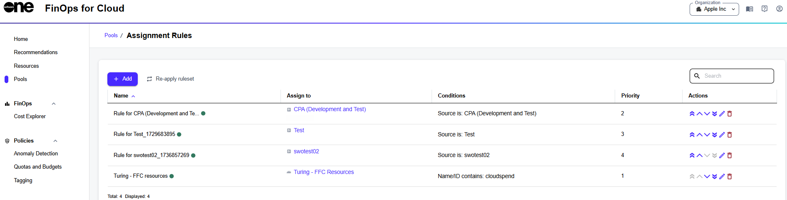

# View and Manage Assignment Rules

The **Assignment rules** page in FinOps for Cloud allows you to add a new automatic resource assignment rule.&#x20;

From this page, you can also reapply the entire ruleset to all resources within a selected pool, even if the ruleset was previously assigned manually.

You can manage existing rules and search for specific rules using filters such as **Name**, **Assigned To**, **Conditions**, and **Priority**.

## Viewing assignment rules

1. Navigate to the **Pools** page.&#x20;
2. Select **Configure assignment rules**. The list of rules is displayed.&#x20;

<figure><figcaption>
Assignment rules page displaying all rules
</figcaption></figure>

For each rule, you can view the following details:

* **Name** - The name of the rule. Active rules are marked with green dots next to their names, and inactive ones are marked with grey dots.
* **Assign to** - The pool and the owner to whom the resource is assigned.
* **Conditions** - Shows a summary of the conditions that trigger the rule.
* **Priority** - Displays the priority used to apply assignment rules to resources.

## Managing assignment rules

The **Actions** column on the **Assignment Rules** page contains options you can use to manage your existing rules.

* To modify a rule, select the edit icon <path d=&#x22;M200-200h57l391-391-57-57-391 391v57Zm-80 80v-170l528-527q12-11 26.5-17t30.5-6q16 0 31 6t26 18l55 56q12 11 17.5 26t5.5 30q0 16-5.5 30.5T817-647L290-120H120Zm640-584-56-56 56 56Zm-141 85-28-29 57 57-29-28Z&#x22;/></svg>" data-size="line">. You can edit the name of the rule, conditions, and assignment details. You can also enable or disable the rule.
* To set the rule priority to the highest, select <path d=&#x22;m296-224-56-56 240-240 240 240-56 56-184-183-184 183Zm0-240-56-56 240-240 240 240-56 56-184-183-184 183Z&#x22;/></svg>" data-size="line">. The priority of the other rules is then decreased by one.
* To decrease rule priority by 1, select <path d=&#x22;M480-344 240-584l56-56 184 184 184-184 56 56-240 240Z&#x22;/></svg>" data-size="line">. The rule is then swapped with the rule behind it.
* To increase the rule priority by 1, select<path d=&#x22;M480-528 296-344l-56-56 240-240 240 240-56 56-184-184Z&#x22;/></svg>" data-size="line"> . The rule is swapped with the previous rule.
* To assign the rule with the lowest priority across the given organization, select <path d=&#x22;M480-200 240-440l56-56 184 183 184-183 56 56-240 240Zm0-240L240-680l56-56 184 183 184-183 56 56-240 240Z&#x22;/></svg>" data-size="line">. All other affected rules are then updated.
* To delete a rule, select <path d=&#x22;M280-120q-33 0-56.5-23.5T200-200v-520h-40v-80h200v-40h240v40h200v80h-40v520q0 33-23.5 56.5T680-120H280Zm400-600H280v520h400v-520ZM360-280h80v-360h-80v360Zm160 0h80v-360h-80v360ZM280-720v520-520Z&#x22;/></svg>" data-size="line">. To learn more, see [Delete Pools](delete-a-pool.md).
