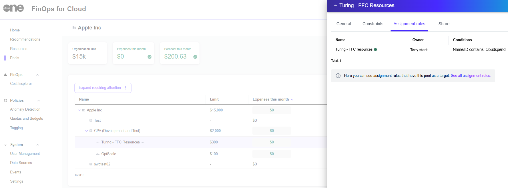

# View Pool Assignment Rules

You can view the assignment rules associated with a selected pool from the **Assignment rules** tab on the pool's details page.&#x20;

This view provides insight into how resources are assigned and managed within the pool, ensuring transparency and making it easier to verify or update rules by centralizing them in one place.

Each rule displays key information, including its **Name**, **Owner**, and **Conditions**. The **Conditions** column offers a detailed summary of the criteria defined for each rule, such as **Name/ID contains**, **Tag is**, or **Source is**.

## Viewing pool assignment rules

To view the assignment rules for a pool:

1. Navigate to the **Pools** page.&#x20;
2. Select the desired pool group or subpool.
3. Select the **Assignment rules** tab. All assignment rules that have the given pool as a target are displayed.
4. (Optional) Select **See all assignment rules** to navigate to the main assignment rules listing page, where you can manage all rules across different pools.

<figure><figcaption>
Assignment rules for a pool.
</figcaption></figure>
