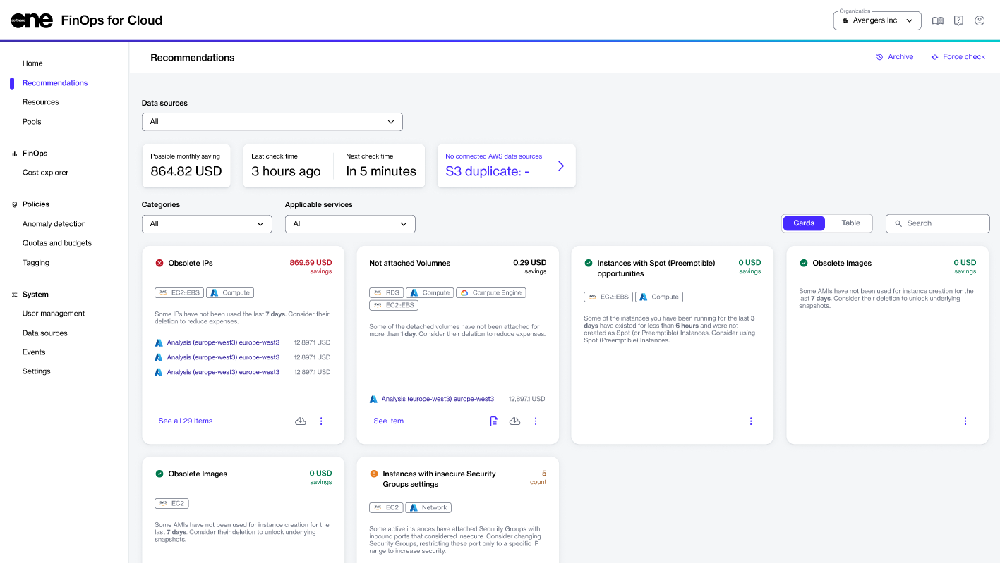

# Recommendations

The Recommendations page is designed to make you aware of the less apparent deficiencies of the infrastructure, like configuration flaws and security risks.&#x20;

To receive recommendations, it's essential to [add a data source](../../finops-for-cloud/getting-started/data-sources.md) to FinOps for Cloud. Once a data source is added, FinOps for Cloud analyzes it to provide recommendations to help you optimize costs and improve resource security, performance, and availability.&#x20;

Currently, FinOps for Cloud performs a check every 3 hours and displays recommendations, but **Organization Managers** can initialize a force check to immediately run the data sources' evaluation sequence.

All recommendations can be analyzed on the **Recommendations** page, which displays a summary of each recommendation [across different categories](recommendation-categories/) and suggests actions to help you make informed decisions.&#x20;

<figure><figcaption>
Recommendations page in FinOps for Cloud
</figcaption></figure>

You can also see possible monthly savings that can be achieved if the suggestions are implemented. Additionally, you can view the time when FinOps for Cloud last checked for an update, and when the next recommendation is due.&#x20;

All recommendations include a description and details, and one of the following symbols:

* A red symbol  indicates a critical situation, indicating that you should focus on the card and its information.
* A green symbol  indicates that there are no recommendations or that potential savings are zero.
* An orange symbol  appears when certain items require attention.

The content of the last summary card or recommendation varies, depending on the condition. For instance, the card might show AWS S3 duplicates found during the last check, checks that did not start or finish successfully, and so on. See [Savings Optimization Recommendations](recommendation-categories/savings-optimization-recommendations.md) and [Security Recommendations](recommendation-categories/security-recommendations.md) for details on specific recommendations.&#x20;

Selecting a recommendation opens a summary page, which shows a table containing all checks and the option for you to initiate a new check.&#x20;

## Filtering recommendations 

By default, all recommendations are displayed on the page, but you can filter recommendations based on data source, category (**Savings**, **Security**, **Critical**, and **Non-empty**), and applicable services.

You can also customize the parameters for a recommendation, exclude pools, and pin or unpin recommendations. For more information, see [Customize Recommendations](customize-recommendations.md).
