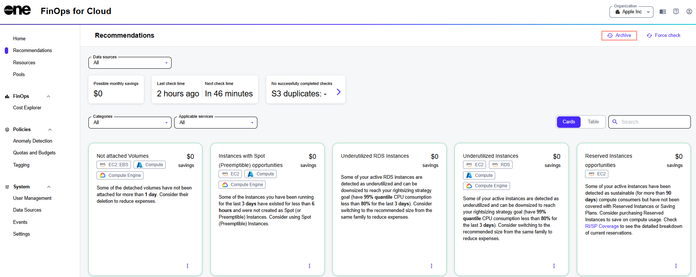

# View Recommendations

## Viewing recommendations 

To view recommendations:

1. Navigate to the **Recommendations** page from the sidebar.
2. (Optional) Choose the billing data source for which you want to view recommendations. You can select multiple sources at once. For information on the supported sources and how to add them, see [Add Data Sources](../../finops-for-cloud/getting-started/data-sources.md).
3. (Optional) Choose a category. The default setting is **All**, meaning all recommendations are displayed, but you can filter by **Savings**, **Security**, **Critical**, and **Non-empty** to display the recommendations you want to see.
4. (Optional) Select the applicable service from the list. You can select multiple services at once.
5. (Optional) Choose if you want to view your recommendations in the form of cards or tables.
6. Review the suggested optimizations and their projected savings.
7. Select a recommendation to open a summary page.&#x20;

## Viewing archived recommendations

Recommendations are archived when they are no longer active, either because they have been applied, the associated resource has been removed, or they have become irrelevant due to changes in resource properties.

To view your archived recommendations:

1. On the **Recommendations** page, select **Archive**.

<figure><figcaption>
The Archive option on the Recommendations page.
</figcaption></figure>

2. On the **Archived recommendations** page:
   1. (Optional) Use the date selector to use a custom date range, or select any of these options:&#x20;
      * **This month** - Displays archived recommendations from the current month.
      * **Last month** - Displays archived recommendations from the last month.
      * **Last 7 days** - Displays archived recommendations from seven days ago until now.
      * **Last 30 days** - Displays archived recommendations from 30 days ago until now.
   2. Select the recommendation to view details, such as the data and time when the recommendation was detected, the resource to which the recommendation applies, and more.
