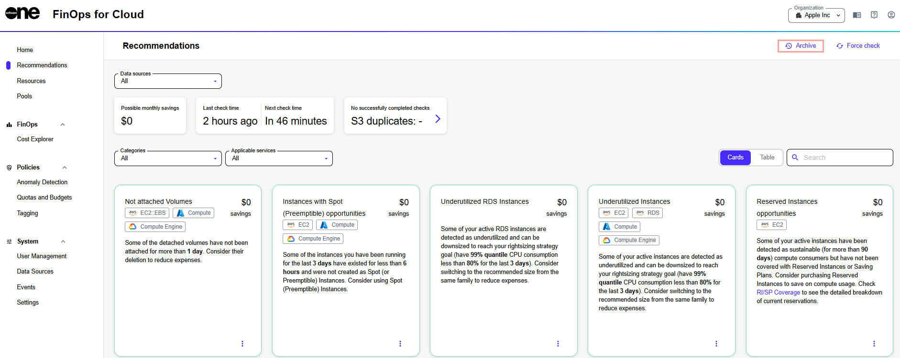

# View recommendations

This topic describes how to view and filter recommendations, review potential savings opportunities, and access archived recommendations.

### View recommendations 

To view recommendations:

1. From the left sidebar, navigate to **Recommendations**.
2. (Optional) Select one or more billing data sources for which you want to view recommendations. For information about supported sources and how to add them, see [Add data sources](../../finops-for-cloud/getting-started/data-sources.md).
3. (Optional) Select a category. By default, **All** is selected, and all recommendations are displayed. You can filter recommendations by **Savings**, **Security**, **Critical**, or **Non-empty**.
4. (Optional) Select one or more services.
5. (Optional) Choose whether to display recommendations as cards or a table.
6. Review the suggested optimizations and their projected savings.
7. Select a recommendation to view its details.

### View archived recommendations

Recommendations are archived when they are no longer active, for example, because they have been applied, the associated resource has been removed, or changes to the resource have made the recommendation no longer relevant.

To view your archived recommendations:

1. On the **Recommendations** page, select **Archive**.

<figure><figcaption>
The Archive option on the Recommendations page.
</figcaption></figure>

2. On the **Archived recommendations** page:
   1. (Optional) Select a custom date range, or choose any of these options:&#x20;
      * **This month** - Displays archived recommendations from the current month.
      * **Last month** - Displays archived recommendations from the last month.
      * **Last 7 days** - Displays archived recommendations from seven days ago until now.
      * **Last 30 days** - Displays archived recommendations from 30 days ago until now.
   2. Select a recommendation to view details, such as when it was detected and the resource to which it applies.
