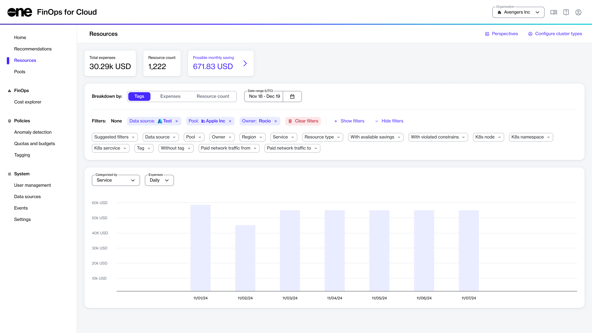

# Resources

The **Resources** page provides a detailed overview of all available cloud resources, detailing their usage and associated costs. You can use this page to efficiently monitor and manage your cloud resources.

The page displays data in graphical format and in a table. The graphic visualization includes various types of charts, such as bar charts and line graphs, helping you understand trends, patterns, and anomalies in your cloud resource usage and expenses. The tabular data includes specific data points and metrics, including columns for different parameters, such as resource type, cost, usage, tags, owner, and more.

<figure><figcaption>
The Resources page in FinOps for Cloud.
</figcaption></figure>

### Using resource filters

By default, the **Resources** page displays details about all cloud resources, including total expenses and the resource count. You can narrow down the data using customization features such as date range and filters.

* The **Date range** filter allows you to select a custom date range for your data. This provides flexibility in analyzing cloud resource usage and expenses over different periods.
* The **Filters** section contains various options to include or exclude specific data. This includes filtering by resource type, owner, expense type, tags, and more. Each filter has its own suboptions you can select and apply. Additionally, you can combine multiple filters to further refine your analysis.

When you apply the filter options, the corresponding data updates automatically based on your selections. You can view the data as a chart or within the resources table.&#x20;

To download the chart as a PNG image file, select **Export data**.

### Additional actions 

On the **Resources** page, you can do the following:

* Save, apply, and manage your existing perspectives. A perspective is a customized view containing filters and settings you have specified. For more details, see [Manage Perspectives](manage-perspectives.md).
* Download a list of resources in the Excel or JSON format. For more details, see [Download Resources](download-resources.md).
* View the full details of a resource and apply constraints to a specific resource using the resource details page. For more details, see [View Resource Details](view-resource-details.md) and [Apply Constraints](resources-constraint-policies.md).
