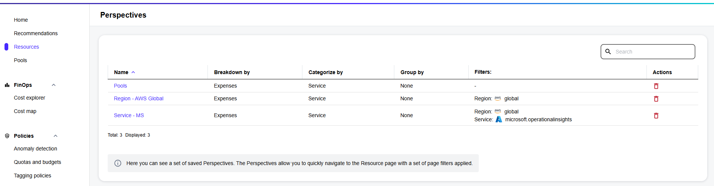

# Manage Perspectives

The **Perspective** feature on the **Resources** page allows you to create new perspectives.

A perspective is a customized view that you can create using only the filters you need. For example, you can save a view that shows only certain data sources, regions, or resource types. This ensures you can quickly return to your preferred view without reconfiguring the filters each time.&#x20;

You can create multiple perspectives and save them for future use. When saving perspectives, make sure to use different names, as you cannot have two perspectives with the same name. If you use the same name for a new perspective, the platform overwrites the existing one.

You can also share the perspective URL with others in your organization, and delete a perspective if it's no longer needed.

### Saving a perspective

To save a custom perspective:

1. From the sidebar, navigate to the **Resources** page.
2. Select **Save perspective**.
3. Under **Save as**, enter a name for your custom perspective, then select **Save**. The configuration is saved as a perspective.

### Applying a saved perspective

Saved perspectives are displayed when you select **Perspective** on the **Resources** page. The option is enabled only if you have previously saved at least one perspective.

To apply a saved perspective:

1. On the **Resources** page, select **Perspectives**.
2. Choose the perspective you want to view and select **Apply**.

When the perspective is applied, the **Resources** page updates its title to include the name of the perspective. Additionally, a link to copy the URL appears beside the name, allowing you to share the perspective with others.

### Deleting a perspective

You can delete perspectives that are no longer needed.

To delete a perspective:

1. On the **Resources** page, select **Perspectives**.
2. Select the **See all Perspectives** link.&#x20;
3. From the available perspectives, find the one you want to delete. Then, under **Actions**, select the delete icon.

<figure><figcaption>
The Actions column containing an option to delete a perspective.
</figcaption></figure>

4. In the **Delete perspective** panel, select **Delete** again to confirm the action.
