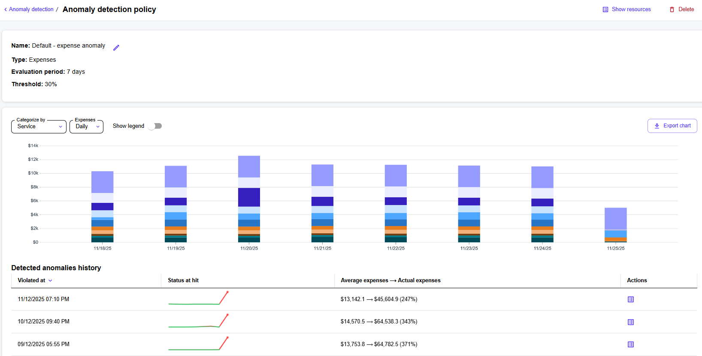

# Manage Anomaly Detection Policies

The **Anomaly detection** page displays all resource count and expense anomaly policies you have created. You can get detailed information for a policy by selecting the policy name. This includes general information, the date of violation, status, average, and actual counts.&#x20;

From the policy details page, you can edit the policy name. You can also delete the policy, [download the chart as a PNG file](export-chart.md), and view the violation history.

<figure><figcaption>
The details page of an anomaly detection policy.
</figcaption></figure>

### Renaming a policy

To rename an existing anomaly detection policy:

1. Navigate to the **Anomaly detection** page.
2. In the list of policies, select the policy you want to rename.
3. On the policy details page, select the edit icon <path d=&#x22;M200-200h57l391-391-57-57-391 391v57Zm-80 80v-170l528-527q12-11 26.5-17t30.5-6q16 0 31 6t26 18l55 56q12 11 17.5 26t5.5 30q0 16-5.5 30.5T817-647L290-120H120Zm640-584-56-56 56 56Zm-141 85-28-29 57 57-29-28Z&#x22;/></svg>" data-size="line">.
4. Under **Name**, enter the new name, then save your changes.&#x20;

### Deleting a policy


Deleted policies cannot be restored.


To delete an existing anomaly detection policy:

1. Navigate to the **Anomaly detection** page.
2. In the list of policies, select the policy you want to delete.
3. On the policy details page, select **Delete**.
4. In the confirmation panel, select **Delete** to confirm the action.
