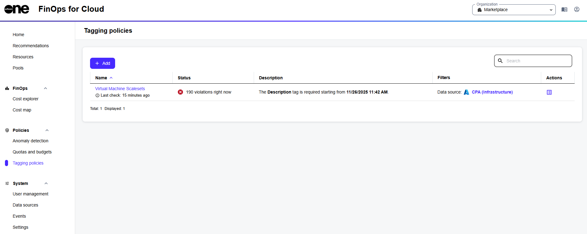

# Tagging Policies

Tagging Policies are a type of policy that can help ensure that your resources are properly categorized and monitored.&#x20;

Tagging policies use custom tags, which are descriptive labels assigned to resources. These tags help identify resources among others, making it easier for you to locate and manage them.&#x20;

### Tagging policies in FinOps for Cloud

In FinOps for Cloud, Organization Managers can create new tagging policies using the **Add** option on the **Tagging policies** page.&#x20;

When creating a new policy, you can specify the tagging rules applicable to resources when they are tagged. If the policy is violated, FinOps for Cloud sends an email notification to the Organization Manager.&#x20;

<figure><figcaption>
Tagging policies in FinOps for Cloud.
</figcaption></figure>

### Additional actions 

From the **Tagging Policies** page, you can create new policies and monitor your existing tagging policies. You can also do the following:

* View the timestamp of the last policy check.&#x20;
* Review the status of the policy, including any violations, to determine resources that are not complying with the tagging policy.
  * A red icon indicates that resources violating the tagging rules have been identified.
  * A green icon shows that all resources covered by the policy currently meet its tagging rules.
  * No status information yet means that the policy is newly created and hasn't run an evaluation cycle, or the filters may exclude all current resources, resulting in no data to check.
* Read a brief **description** of what the policy monitors, including the scope, type, and enforcement timeline.
* Access all resources associated with the tagging policy by selecting the **Show resources** icon in the **Actions** column.&#x20;
