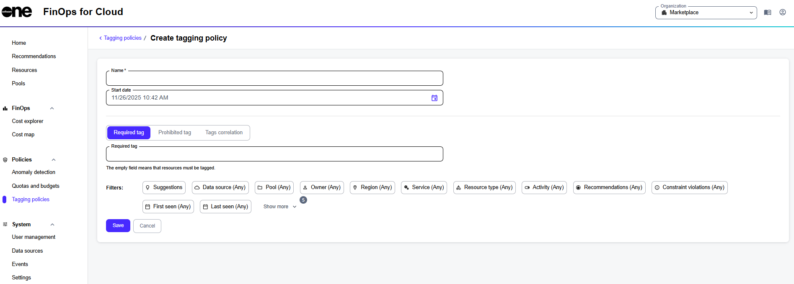

# Create Tagging Policies

Organization Managers create new tagging policies by using the **Add** option on the **Tagging policies** page. Multiple policies can be created; for instance, you can create one policy that applies to all resources and another policy that applies to specific resource types.

After entering the policy details and filters, you can save the policy to begin monitoring. This ensures that the policy is applied to relevant resources and helps ensure compliance with the organization's tagging standards.

### Creating a tagging policy

To create a new tagging policy:

1. Navigate to the **Tagging policies** page, then select **Add**.&#x20;
2. On the **Create tagging policy** page, enter a name for the policy and select the date and time when the policy must start.

<figure><figcaption>
Create a new tagging policy.
</figcaption></figure>

3. Choose whether the policy requires certain tags, prohibits certain tags, or defines a correlation between tags.
4. Enter the values in the additional fields according to your selected tagging rule.
   * If you selected the **Required tag** option, specify tags that must be present.
   * If you selected the **Prohibited tag** option, specify tags that must not be present.
   * If you selected the **Tags correlation** option, specify the primary and correlated tags.
5. (Optional) Use filters to apply additional tagging rules.
6. Select **Save** to finish creating the policy.&#x20;

Once the policy has been created, FinOps for Cloud sends an email notification to the Organization Manager when the policy is violated.&#x20;
