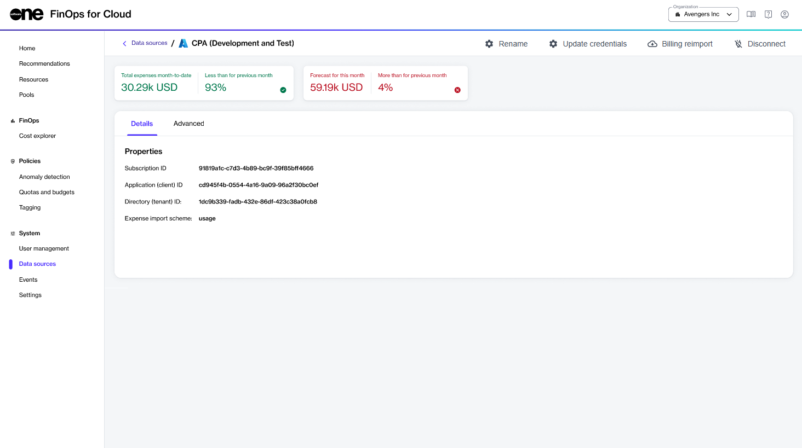

# Add your AWS account to FinOps for Cloud

## Adding a management or standalone AWS account

The steps to add a management account or standalone account are similar.

* If you are adding a management account, choose the **Management** account type
* If you are adding a standalone account, or a member account without a management account, choose the **Standalone** account type.

When you add a management or standalone account, you must enter the details of the role to assume (or IAM user and access key) as well as the details of the billing export.

<figure><figcaption>
Adding a management account to FinOps for Cloud using an assumed role
</figcaption></figure>

## Adding a member AWS account

The steps to add a member account that already has its management account added to FinOps for Cloud are simpler.

<figure><figcaption>
Adding a member account to FinOps for Cloud using an assumed role
</figcaption></figure>
