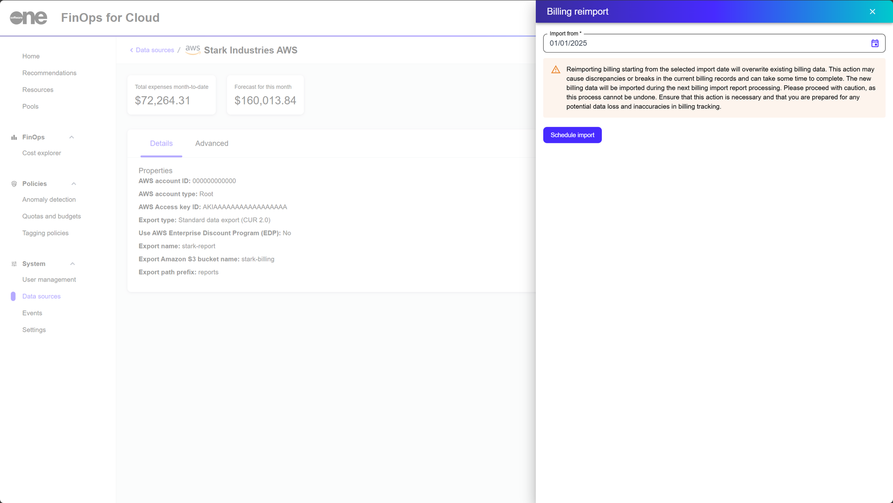

# Request Historical Data

When you create a Cost and Usage Report in an AWS-linked account, the S3 bucket is automatically populated with data from the beginning of the current month.&#x20;

However, if the AWS account has existed for longer than this period, you can request a backfill of historical cost and usage data.

## Requesting a backfill of your cost data

To request a backfill of your historical data, create a support case with AWS.&#x20;

For information on how to open a support case and the information to include in your request, see the following link in the AWS Data Exports User Guide:

[https://docs.aws.amazon.com/cur/latest/userguide/troubleshooting.html#backfill-data](https://docs.aws.amazon.com/cur/latest/userguide/troubleshooting.html#backfill-data)

## Performing a billing reimport in FinOps 

To perform a billing reimport in FinOps for Cloud:

1. Navigate to the **Data sources** page.
2. Select the AWS data source containing the updated S3 bucket. Then, select **Billing reimport**.
3. In **Import from**, choose the start date of your historical billing data.
4. Select **Schedule import**.&#x20;

<figure><figcaption>
The option to reimport billing data.
</figcaption></figure>

Once the import process has been initiated, it might take several hours, depending on the amount of historical data.&#x20;
