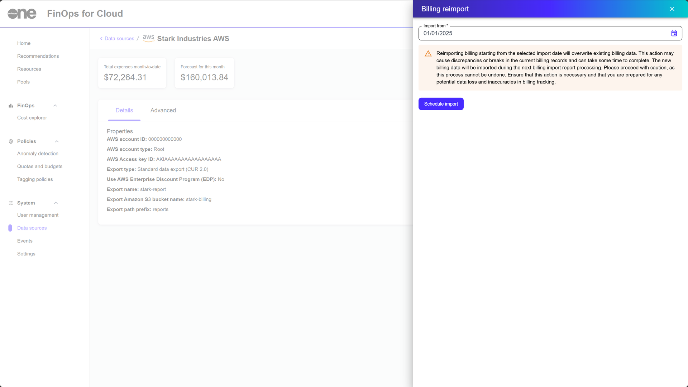

# Reimport Billing

The **Billing Reimport** option is available on the details page of a data source in FinOps for Cloud.&#x20;

This feature allows you to manually reimport your billing data starting from a specific date into FinOps for Cloud. You can manually reimport data if:

* Your billing data has not been imported as expected.
* You have made configuration or permission-related changes that require reimporting data to reflect those updates.
* You need historical billing data from months that were not previously imported.&#x20;

## Performing a billing reimport


Before performing a billing reimport, note the following points:

* Importing billing data from the specified date overwrites the existing billing records. This can cause discrepancies or interruptions in current billing data.
* The reimport process is irreversible. Once the process has been initiated, it cannot be stopped. Additionally, the process could take some time to complete, depending on the amount of data.
* The new billing data will be imported during the next billing import report processing.


To manually trigger a billing data reimport:

1. In FinOps for Cloud, navigate to the **Data sources** page.&#x20;
2. Select the desired data source.&#x20;
3. On the details page of the selected data source, select **Billing reimport**.
4. Choose the start date from which you want historical data imported, then select **Set**.
5. Select **Schedule import** to start the reimport process.

<figure><figcaption>
Schedule import
</figcaption></figure>
