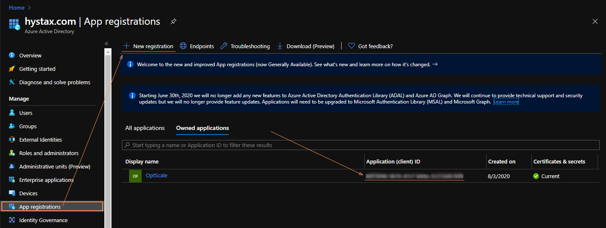
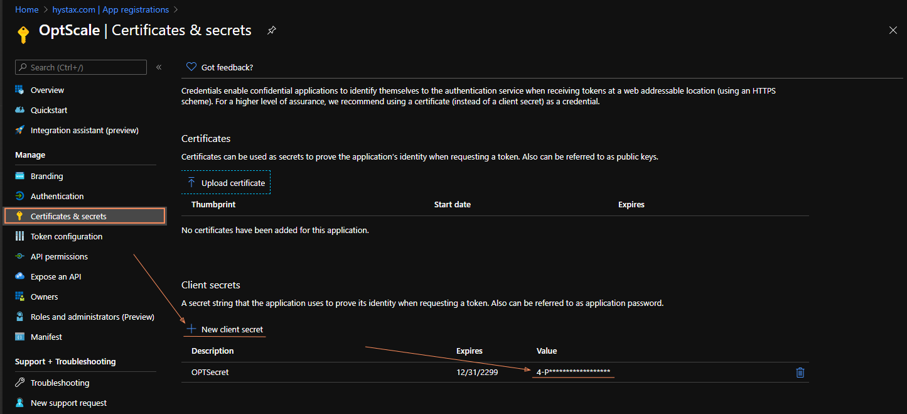
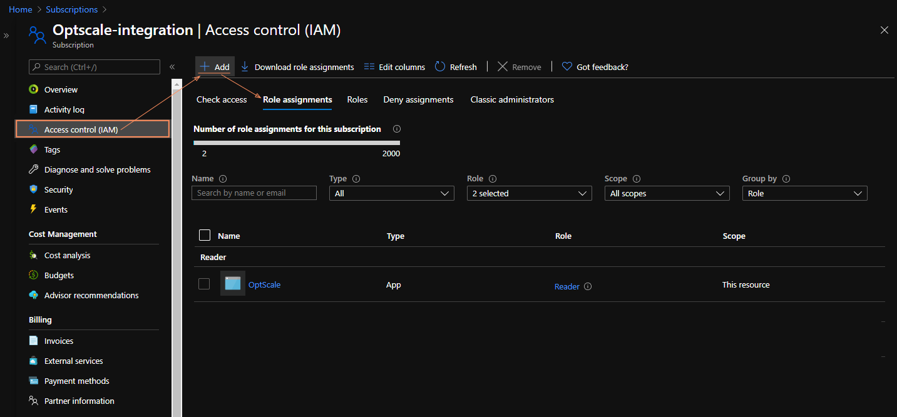
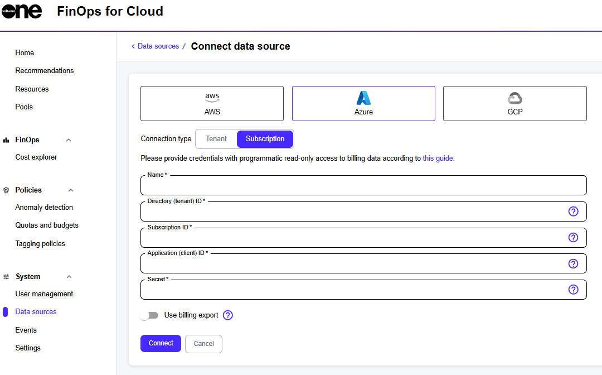

# Microsoft Azure

This topic describes how you can add an Azure data source to FinOps for Cloud. It also describes the prerequisites that must be met to connect the source successfully.

## Prerequisites 

When connecting your Azure data source to FinOps for Cloud, you must provide the following details from Microsoft Azure:&#x20;

* Application ID (client ID)
* Client Secret
* Directory (tenant) ID
* Subscription ID

Additionally, the **Reader** role must be assigned to the application.&#x20;

The following sections describe how to get these values from Azure. Once you have completed all the prerequisites, see [Connecting your Azure data source](microsoft-azure.md#connecting-your-azure-data-source-in-finops) for the next steps.&#x20;

### Generating the application ID (client ID)

The application ID (client ID) must be generated manually in Azure to allow API communication with FinOps.&#x20;

To generate the application ID (client ID):

1. In Microsoft Entra ID (formerly Azure Active Directory), navigate to **App registrations**.
2. Select **New registration**.&#x20;
3. Provide a name for the application, for example, Optscale.
4. Select **Register**.&#x20;

After the application is successfully registered, the application ID is displayed. Make a note of the value. You'll need to enter it in the **Application (client) ID** field within FinOps.&#x20;

After registering the application, you must also explicitly grant it permissions using Role Assignment to work with the current Azure subscription. See [Performing role assignment](microsoft-azure.md#performing-role-assignment) for details.

<figure><figcaption></figcaption></figure>

### Generating a client **secret**

To generate a client secret:

1. In the Azure portal, navigate to your newly created application. Then, select **Certificates & Secrets.**
2. Select **New client secret**.
3. Provide a description of the secret and set the expiration date.&#x20;
4. Select **Add**. The secret's value is displayed in the **Value** column.
5. Copy this value immediately. You'll need to enter it in the **Secret** field within FinOps when connecting your Azure subscription.


The secret's value is hidden shortly after its creation. Make sure to copy the value.


<figure><figcaption></figcaption></figure>

### Locating your directory (tenant) ID

The Directory (tenant) ID is a globally unique identifier (GUID) that is different from your organization's name or domain. You can find this ID in the Microsoft Azure portal.

To locate your Directory ID in the Microsoft Azure portal:

1. Navigate to **App registrations** (for example, OptScale) > **Overview** > **Directory (tenant) ID**.&#x20;
2. Copy the value. You'll need to enter it in the **Directory (tenant)** ID field within FinOps for Cloud when connecting the Azure subscription.

<figure><figcaption></figcaption></figure>

### Locating your subscription ID

A subscription ID is a unique string that identifies your subscription.&#x20;

To find the ID in the Microsoft Azure portal, search for **Subscriptions**. You'll see a list of all subscriptions associated with your Azure account. The list will include a subscription ID for each subscription.&#x20;

### Performing role assignment

To assign the reader role to the subscription you have provisioned to be linked to FinOps:

1. In the Azure portal, navigate to **Subscriptions**.
2. Select the subscription. You'll be directed to its dashboard.
3. In the left sidebar, select **Access control (IAM)** and select the **Role assignments** tab. Then, select **Add** > **Add role assignment**.

<figure><figcaption></figcaption></figure>

4. In **Add role assignment**, do the following:
   1. On the **Role** tab, choose **Reader** and select **Next**.
   2. On the **Members** tab, make sure that **User, group, or service principal** is selected. Then, select **Next**.
   3. The third field should contain the name of a registered application from the previous steps, for example, FinOps. Select **Next.**
   4. On the **Review + assign** tab, review the role assignment settings, then select **Review + assign** to assign the role.

## Connecting the Azure data source

When all of the [prerequisites](microsoft-azure.md#icazs-guid-4a5d37a7-53ff-4cd8-902a-5d5a58b1e21f) are complete, you can connect your Azure data source to FinOps for Cloud.&#x20;

To connect the data source:

1. Navigate to the **Data sources** page, then select **Azure**.

<figure><figcaption>
Connect an Azure data source to FinOps for Cloud.
</figcaption></figure>

2. Choose the connection type: **Tenant** or **Subscription**.
3. Provide the information for that connection:&#x20;
   1. **Name** - Enter a meaningful name for the data source.
   2. **Directory (tenant) ID** - Enter the unique identifier of the tenant.
   3. **Subscription ID** - Enter the ID for the Azure subscription you want to integrate. You can find this ID in the Azure Portal. This field is required only if the connection type is **Subscription.**
   4. **Application (client) ID** - Provide your application ID (client ID).&#x20;
   5. **Secret** - Provide your client secret.
4. Select **Connect**.&#x20;

FinOps for Cloud validates the information. When the validation completes, the data is pulled from the source and displayed in the platform.
