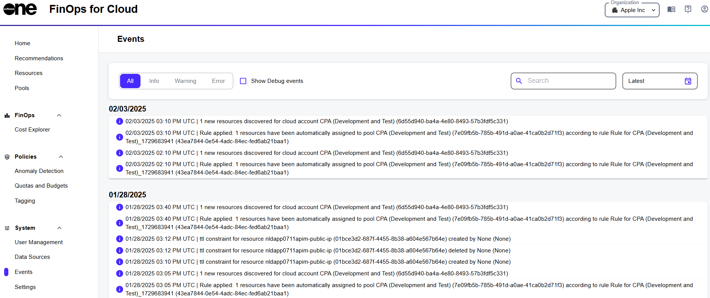

# Events

The **Events** page in FinOps for Cloud is a read-only page that displays all events that have occurred within your organization.&#x20;

The data on this page is continuously updated, allowing you to monitor and track events in real time. You can view both system-generated as well as user-generated events. The following are some examples of the events you might see:

* Discovery of new resources for cloud accounts.
* Automatic assignment of resources to a pool.
* Invitations sent to new account members.
* Resource discovery failures.

<figure><figcaption>
Events page in FinOps for Cloud
</figcaption></figure>

## Filtering events

By default, all events are displayed on the page.&#x20;

To filter the list of events, choose from one of these options: **Info**, **Warning**, or **Error**. By default, all events are displayed on the page.

Additionally, you can also use the date selector <path d=&#x22;M320-400q-17 0-28.5-11.5T280-440q0-17 11.5-28.5T320-480q17 0 28.5 11.5T360-440q0 17-11.5 28.5T320-400Zm160 0q-17 0-28.5-11.5T440-440q0-17 11.5-28.5T480-480q17 0 28.5 11.5T520-440q0 17-11.5 28.5T480-400Zm160 0q-17 0-28.5-11.5T600-440q0-17 11.5-28.5T640-480q17 0 28.5 11.5T680-440q0 17-11.5 28.5T640-400ZM200-80q-33 0-56.5-23.5T120-160v-560q0-33 23.5-56.5T200-800h40v-80h80v80h320v-80h80v80h40q33 0 56.5 23.5T840-720v560q0 33-23.5 56.5T760-80H200Zm0-80h560v-400H200v400Zm0-480h560v-80H200v80Zm0 0v-80 80Z&#x22;/></svg>" data-size="line"> to choose a custom date range for the events you want to view.&#x20;

## Searching for an event

To search for a specific event, enter a keyword in the **Search** field and press **Enter**.

## Viewing event details

To view detailed information for an event, select the event.&#x20;

You can then view the date and time the event occurred, a description of the event, and details of the object involved in the event.
