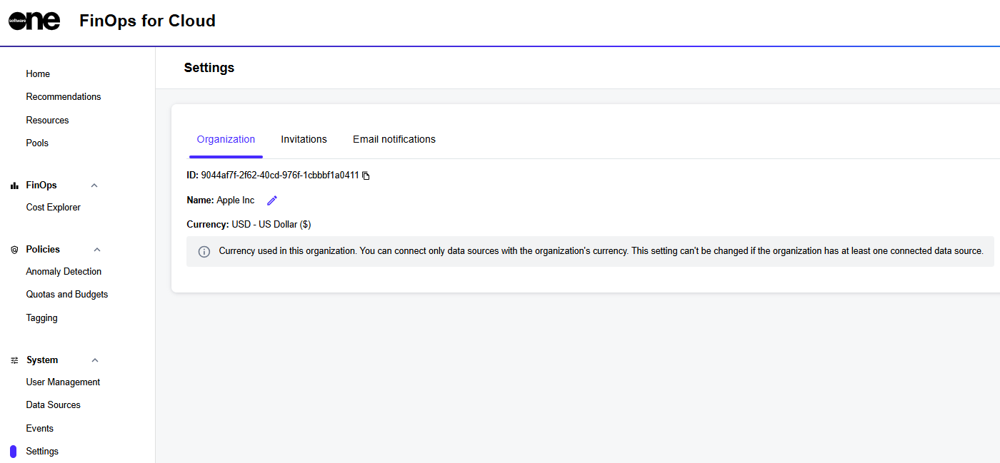

# Settings

The **Settings** page in FinOps for Cloud lets you view and manage your organization settings, account invitations, and email notifications.&#x20;

<figure><figcaption>
Settings page within FinOps for Cloud
</figcaption></figure>

* **Organization** - From this tab, you can retrieve and copy your organization ID and edit your organization name. You can also view the organization's currency. Note that you can connect only those data sources that match the organization's currency. This setting cannot be changed if at least one data source is already connected.
* **Invitations** - If you have any pending invitations to join an organization on the FinOps platform, those invitations are displayed on this tab. Use this tab to manage those pending invitations.
* **Email notifications** - Use this tab to configure email alerts. For details, see [Manage Email Notifications](manage-email-notifications.md).
