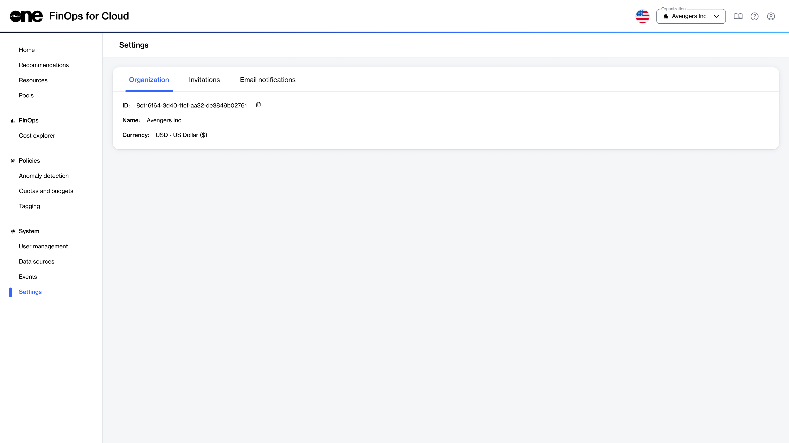

# Settings

The **Settings** page in FinOps for Cloud lets you view and manage your organization settings, account invitations, and email notifications.&#x20;

<figure><figcaption>
Use the Settings page to view organizations, invitations, and related settings.
</figcaption></figure>

* **Organization** – From this tab, you can view your organization ID, name, and currency. You can also copy your organization ID. Note that the organization name is **view-only** and cannot be changed from the user interface. To request a change to your organization name, [Contact Support](../../help-and-support/contact-support.md) and provide the following information:
  * Current organization name
  * Organization ID
  * New organization name
* **Invitations** – If you have any pending invitations to join an organization on the FinOps platform, those invitations are displayed on this tab. Use this tab to manage those pending invitations.
* **Email notifications** – Use this tab to configure email alerts. For details, see [Manage Email Notifications](manage-email-notifications.md).
